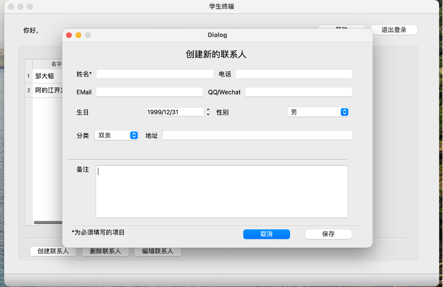
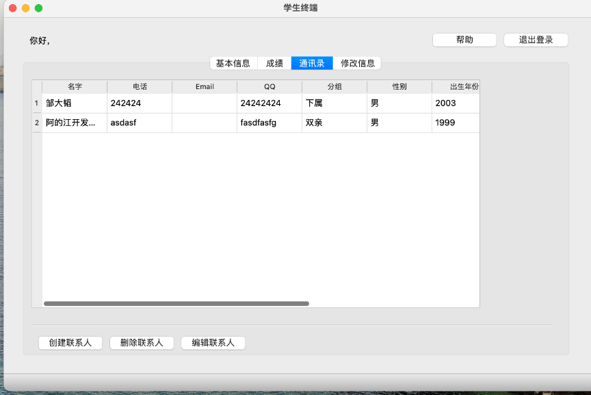
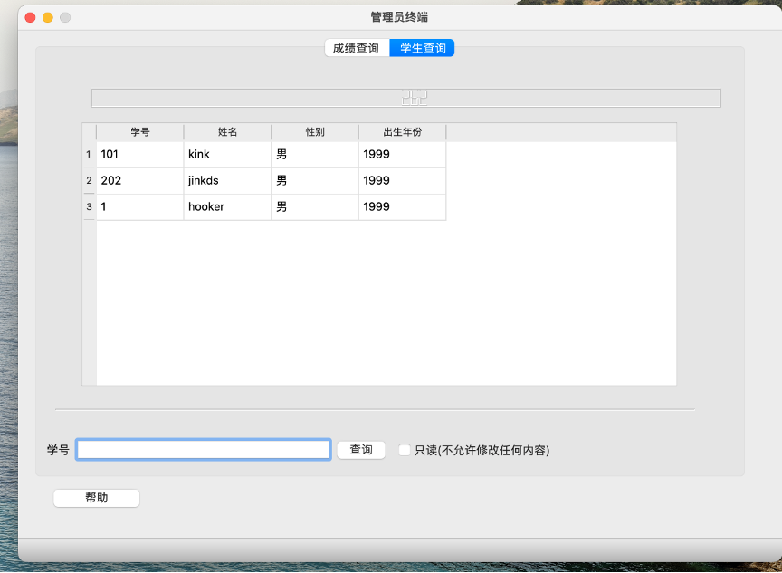

# Student-Management-System

## Description
Firstly, it is imperative to replace manual record-keeping with an electronic information management system in order to enhance the convenience, efficiency, and accuracy of information management. This transition represents the primary user demand, ultimately leading to the objective of reducing the cost associated with information management and improving overall work efficiency.

In terms of content, effective management of college student information necessitates the inclusion of various data categories, such as course details, personal particulars, performance records, and contact information. To establish a comprehensive and cohesive student information repository, the information management system must incorporate three subsystems: information management, performance management, and address book management.

Regarding specific functionalities, the user should have the capability to input student information using the input function. The display function should enable the retrieval and presentation of information, while search and sorting functions enhance information management efficiency. Additionally, considering the dynamic nature of information, the system should incorporate functions for data insertion, modification, deletion, and other relevant operations.

## Images

